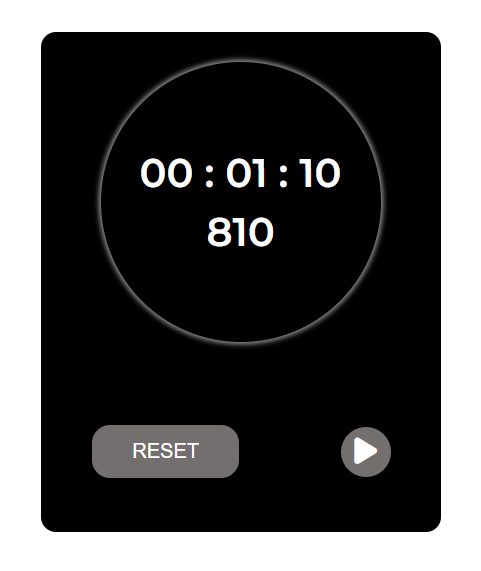

# Stop Watch - JS
## Techniques Used
- html
- css
- JavaScript

### Time Taken: 4 hours

In this project I have written html and css to design stop watch. In javascript part I have used setInterval() funtion to get milliseconds and convert it to seconds and minutes and ClearInterval() funtion to pause and reset the timer.

